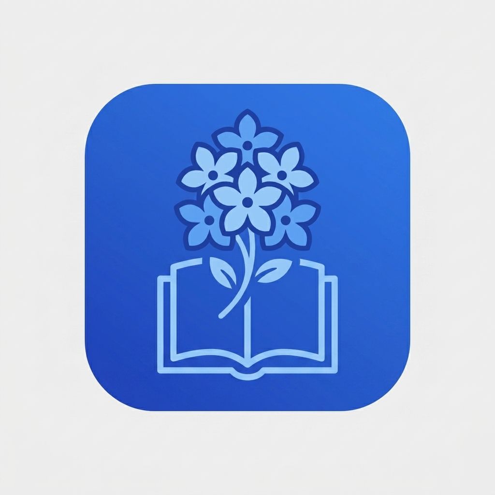

<p align="center">
  
</p>

<h1 align="center">RockyDex</h1>

<p align="center">
  <a href="https://github.com/NgocThachTN/RockyDexMobile/releases/latest">
    
  </a>
  
  
  
</p>

---

## Giới thiệu

RockyDex là ứng dụng đọc truyện tranh di động tối giản, nhanh chóng và mượt mà dành cho người dùng Việt Nam. Ứng dụng được thiết kế tối ưu hóa giao diện với tông màu chủ đạo Xanh Dương - Xám thanh lịch, đồng thời hỗ trợ hiển thị hoàn hảo trên các dòng điện thoại thông minh màn hình nhỏ tỉ lệ 16:9.

---

## Tính năng chính

- **Đọc truyện ngoại tuyến:** Toàn bộ dữ liệu đọc truyện, danh sách yêu thích và lịch sử đọc được lưu trữ offline hoàn toàn trên thiết bị của bạn.
- **Bộ lọc thông minh:** Hỗ trợ tìm kiếm nhanh chóng và lọc truyện theo nhiều tiêu chí như thể loại (cuộn ngang tiện lợi), quốc gia (Manga, Manhua, Manhwa, Việt Nam), năm phát hành và tình trạng dịch.
- **Trải nghiệm đọc tối ưu:** Giao diện đọc truyện thân thiện, tải trang nhanh và ghi nhớ chương đang đọc dở để người dùng tiếp tục theo dõi chỉ với một chạm.
- **Tương thích màn hình 16:9:** Thiết kế bố cục giao diện thông minh, kích thước chữ và các nút bấm tự động co giãn tối ưu cho các dòng máy nhỏ gọn.
- **Hệ thống cập nhật tự động:** Tự động kiểm tra phiên bản mới từ kho lưu trữ GitHub Releases và hiển thị thông báo tải xuống APK cài đặt trực tiếp.

---

## Công nghệ sử dụng

- **Khung phát triển:** Flutter (Dart) phiên bản mới nhất.
- **Quản lý trạng thái:** Flutter Riverpod.
- **Cơ sở dữ liệu:** SQLite (sqflite) để quản lý dữ liệu offline.
- **Điều hướng ứng dụng:** GoRouter.
- **Kiểu chữ:** Google Fonts (Inter) hiển thị tiếng Việt chuẩn xác.

---

## Cài đặt và sử dụng

### Dành cho người dùng cuối
Bạn có thể tải trực tiếp phiên bản cài đặt mới nhất của ứng dụng dưới dạng tệp tin APK tại đường dẫn sau:
[Tải ứng dụng RockyDex tại GitHub Releases](https://github.com/NgocThachTN/RockyDexMobile/releases)

### Dành cho nhà phát triển
Yêu cầu hệ thống: Máy tính đã cài đặt Flutter SDK (phiên bản 3.16 trở lên) và thiết bị Android/giả lập.

1. Bản sao mã nguồn dự án:
   ```bash
   git clone https://github.com/NgocThachTN/RockyDexMobile.git
   ```
2. Di chuyển vào thư mục ứng dụng di động:
   ```bash
   cd RockyDexMobile/mobile
   ```
3. Cài đặt các gói thư viện cần thiết:
   ```bash
   flutter pub get
   ```
4. Khởi chạy dự án trên thiết bị kiểm thử:
   ```bash
   flutter run
   ```

---

## Giấy phép

Dự án này được phát hành dưới Giấy phép MIT. Xem tệp LICENSE để biết thêm thông tin chi tiết.
